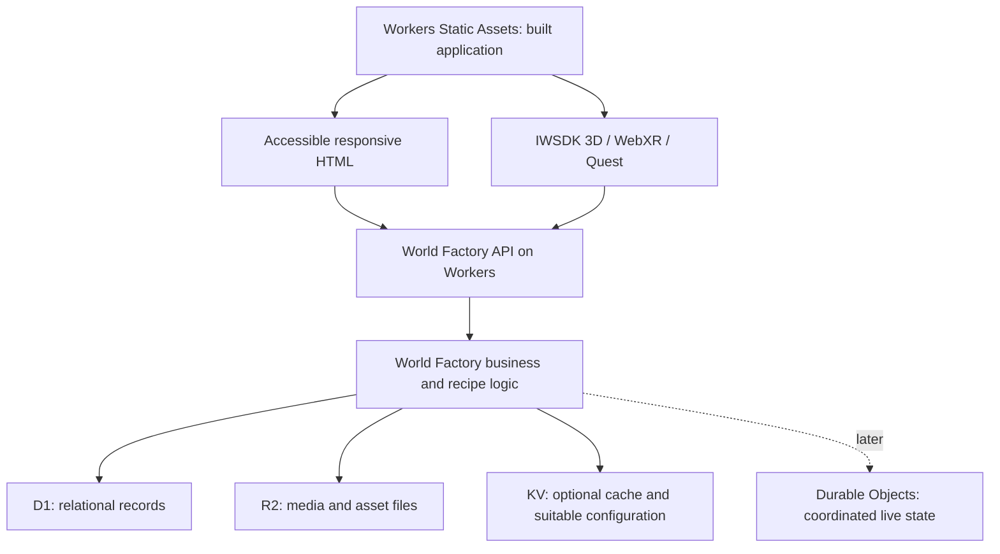

# World Factory platform direction

Status: selected technology direction and proposed responsibility boundaries.
Documentation only; infrastructure and application implementation have not begun.

## Logical application layers

```text
World Factory
|-- Core
|-- Data
|-- Recipes
|-- Systems
|-- Services
|-- UI
|-- Accessibility
`-- Engine Adapters
    `-- IWSDK
```

This is the intended logical structure, not a request to create folders or
packages now. Define concrete modules only when the first recipe needs them.

| Layer | Responsibility |
| --- | --- |
| Core | Shared domain concepts, identifiers, rules, and application action contracts; independent of rendering and infrastructure APIs |
| Data | Structured content schemas, validation, and repository contracts for shared records |
| Recipes | Declarative, versioned compositions of content and reusable capabilities, beginning with `ImmersiveWebsiteRecipe` and then the Chamber Recipe |
| Systems | Reusable application behaviors, such as portal navigation or agent interaction, expressed through shared actions and contracts |
| Services | Application use cases and service contracts, with replaceable infrastructure implementations kept behind those contracts |
| UI | Responsive semantic HTML components and views for essential content and actions, using the same application state as immersive views |
| Accessibility | Shared preference contracts, reusable accessibility behavior, and verification requirements applied across every layer |
| Engine Adapters / IWSDK | Translation of shared content and actions into IWSDK scenes, entities, runtime systems, input, and rendering |

Accessibility is a platform-wide responsibility even though it has a named
layer. UI components and immersive systems must implement its requirements by
default; it is not a later repair pass.

### Dependency boundaries

- Core does not import UI, IWSDK, or Cloudflare implementations.
- Data and recipe contracts use plain domain types rather than IWSDK objects or
  Cloudflare binding types. Business records remain shared across presentations.
- Systems and application services use the contracts they need; infrastructure
  implementations depend on those contracts, not the reverse.
- HTML UI and the IWSDK adapter invoke the same application actions. Essential
  actions must remain available without initializing IWSDK.
- Engine-specific runtime code belongs in the IWSDK adapter. Reuse documented
  IWSDK systems there rather than rebuilding engine behavior in generic layers.
- A reusable name such as `PortalSystem` or `AgentSystem` does not make a class
  engine-independent. If it imports IWSDK, its implementation belongs behind
  the engine adapter boundary. Avoid application-specific names such as
  `ChamberPortal` for behavior shared by recipes.
- Cloudflare repository and service implementations belong at the infrastructure
  boundary, separately from engine adapters. Follow the
  [Cloudflare requirements](cloudflare-requirements.md).
- Application startup wires concrete adapters to contracts. Keep this wiring
  small; do not introduce a general plugin framework or dependency container
  before there is a concrete need.

## Shared foundation

World Factory owns business rules, structured content, recipes, and user actions.
Keep these independent of IWSDK and Cloudflare service bindings wherever practical.
Use small adapters at the presentation and persistence boundaries, introducing
interfaces only as actual features require them.

The same content and business state drive accessible HTML, desktop 3D, and XR.
Essential journeys remain available without 3D or XR, following
[the accessibility requirements](accessibility-requirements.md).



This diagram shows logical responsibilities, not separate deployed services.
The API and business logic can initially live in one Worker. Asset file delivery
may use public URLs or authorized download paths according to asset visibility.

## Service responsibilities

| Technology | World Factory role |
| --- | --- |
| Meta IWSDK | Client-side 3D, WebXR, and Quest presentation and interaction |
| Cloudflare Workers + Static Assets | Website delivery, built client files, API endpoints, and server-side logic |
| Cloudflare D1 | Structured relational business records |
| Cloudflare R2 | Images, video, 360 media, GLB/3D models, textures, and other immersive media files |
| Cloudflare KV | Optional cache and configuration whose consumers can tolerate delayed updates |
| Cloudflare Durable Objects | Later: rooms, presence, multiplayer, live state, and collaboration |

Consume official IWSDK packages. Use the
[official repository](https://github.com/facebook/immersive-web-sdk) and its
documentation, skills, examples, CLI/reference tools, XR emulation, and debugging
tools as authoritative IWSDK references. Do not vendor the repository without a
specific technical reason.

## Data ownership

D1 is the planned source of truth for businesses, worlds, recipes, users,
memberships, events, products, articles, and durable configuration. This is a
domain inventory, not an instruction to create all these tables now. Determine
schemas and relationships as each recipe requires them.

Store media metadata and stable asset references with structured content; store
large file bodies in R2. Include accessibility metadata such as text alternatives
and caption/transcript references in the shared content model. Separate optional
presentation layout from business records so desktop, mobile, and XR do not
create competing copies of the same data.

Workers enforce authorization and validate writes for every presentation.
Cloudflare credentials and storage bindings stay on the server. Account identity
and authentication provider selection remain future decisions; a D1 user record
alone is not an authentication system.

## Consistency and future real-time features

KV is eventually consistent. Use it only where stale reads are acceptable;
do not make it the authority for memberships, access revocation, inventory,
payments, or authoritative live state. Define cache invalidation and tolerated
staleness when a cache is actually introduced.

Durable Objects are reserved for coordinated real-time behavior when a product
needs it. Define ownership of room state and any durable business updates before
adding synchronization with D1. Avoid duplicating authority across stores.
Real-time presence and collaboration do not by themselves provide spatial voice
or video streaming; those media capabilities require a separate design later.

R2 provides object storage. Video transcoding, adaptive streaming, livestreaming,
and media processing are separate concerns to evaluate when needed.

## Lean implementation sequence

Preserve the clean starter baseline. When implementation is authorized, start
with `ImmersiveWebsiteRecipe` (Immersive Website Recipe): shared structured content, accessible HTML,
and the IWSDK presentation. Follow with the Chamber Recipe using reusable
components and systems.

Add Workers, D1, and R2 integration only as that first working slice requires
them. Defer KV until a concrete cache or configuration need exists, and defer
Durable Objects until a real-time feature is in scope. Do not scaffold future
commerce, agent, multiplayer, or publishing systems in advance.

Keep the official IWSDK local development workflow. Design Cloudflare local
development and deployment around it when hosting work is authorized. This
document does not select an account, provision resources, install dependencies,
or deploy the application.

## Official Cloudflare references

- [Workers Static Assets](https://developers.cloudflare.com/workers/static-assets/)
- [D1](https://developers.cloudflare.com/d1/)
- [R2](https://developers.cloudflare.com/r2/)
- [KV consistency and behavior](https://developers.cloudflare.com/kv/concepts/how-kv-works/)
- [Durable Objects](https://developers.cloudflare.com/durable-objects/)
