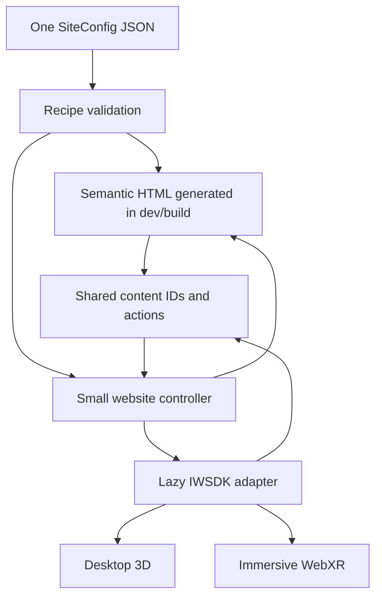

# World Factory: ImmersiveWebsiteRecipe v0.1 proposal

Date: September 25, 2026. **Status: proposed; awaiting approval.**

This document is the deliverable for this step. No application changes, package
installations, SDK upgrades, infrastructure provisioning, or deployment are
authorized by it. It narrows the longer-term [platform direction](platform-architecture.md)
to the first reusable recipe. [Accessibility requirements](accessibility-requirements.md)
and [Cloudflare requirements](cloudflare-requirements.md) remain binding.

## Recommendation

Build one static-first website with an optional IWSDK experience. Use one local,
versioned `SiteConfig` to generate semantic HTML and populate a reusable 3D
exhibit layout. Desktop 3D and immersive WebXR share that same IWSDK world.
The World Factory showcase is configuration data, not a special application
architecture. Start with TypeScript, HTML, CSS, and the installed IWSDK packages.
No new UI framework, backend, database, state library, engine, plugin framework,
or monorepo is needed for v0.1.

The recipe means **schema + validation + HTML presentation + IWSDK presentation**.
It is not a general-purpose world generator yet. One configuration produces one
site build; changing that configuration should produce another business's site
without changing recipe code. Multi-tenant hosting comes later.

## Inspected working baseline

Project root: `C:\Users\insur\CWorldFactory`.

| Item | Observed state |
| --- | --- |
| Runtime/tool versions | `@iwsdk/core`, CLI, reference, and dev plugin are pinned to `1.0.0-rc.2` |
| Rendering dependencies | `three` aliases `super-three@0.181.0`; UIKit, Horizon, and Lucide dependencies already exist |
| Application entry | `src/index.ts` imports `virtual:iwsdk-project`, calls `World.create`, and registers `RobotSystem` and `PanelSystem` |
| Project authority | `iwsdk.config.json`: scene, assets/components modules, world features, and emulator settings |
| Active world composition | `public/scenes/main.iwsdk.scene.json` |
| Asset/component manifests | `src/assets.ts` and `src/components.ts` |
| HTML | `index.html` currently has the scene container, not a conventional content website |
| Enabled features | VR offer, hand tracking, canvas pointers, locomotion, grabbing, Horizon spatial UI |
| Disabled features | Physics, scene understanding, environment raycast |
| Development | `npm run dev` uses the IWSDK-managed workflow; other scripts cover status, shutdown, reference, typecheck, build, and preview |
| Vite | Existing deduplication of Three.js/UIKit prevents duplicate-runtime problems; preserve it |
| Assets | Some sample models use the official example-assets CDN; others are local public files |
| Verification | User verified browser and desktop XR emulation. This proposal does not claim physical-headset or accessibility certification |

Inspected the four existing requirements/research documents, starter entry,
systems, manifests, scene, package/configuration files, installed world and
locomotion declarations, project instructions, and official references below.
The installed declarations confirm `World.destroy`, `launchXR`, `exitXR`,
visibility signals, and browser locomotion options. Reference warmup and
development-tool mutations were not run for this research.

## Meta-first findings: reuse before building

The [official IWSDK repository](https://github.com/facebook/immersive-web-sdk)
is the primary immersive reference. Its live `main` branch may move ahead of
our release candidate. Examples and documentation must be reconciled with the
installed manifest schema and declarations before implementation; do not copy
an older `World.create` options example over `virtual:iwsdk-project`.

| Inspected area | What Meta already supplies | v0.1 decision |
| --- | --- | --- |
| Packages | Core, xr-input, locomotor, scene-composition, create, CLI, dev plugin, reference, reference-assets, and example-assets have separate responsibilities. [Packages](https://github.com/facebook/immersive-web-sdk/tree/main/packages) | Consume official packages already installed; do not clone/build the SDK or add a second ECS. |
| ECS | Entity-component system: entities hold component data and systems query it to implement behavior; World owns the renderer and runtime lifecycle. [ECS architecture](https://iwsdk.dev/concepts/ecs/architecture.html) | Business content stays outside ECS. Add only a content-ID component and a small interaction bridge when needed. |
| Desktop/browser | Core rendering, pointers, audio, UI, physics, and optional browser locomotion work outside an immersive session. Camera style remains application-owned. [Browser-first guide](https://iwsdk.dev/guides/16-browser-first-systems.html) | One runtime, with a bounded exhibit view first. Free-roaming pointer-lock controls are not required for the first website. |
| Spatial UI | Manifest-backed UIKitML renders live UIKit components. DOM and spatial UI have distinct roles. [UIKitML](https://iwsdk.dev/concepts/spatial-ui/uikitml.html), [DOM integration](https://iwsdk.dev/guides/17-react-preact-2d-ui.html) | Use semantic HTML for the site and a reusable UIKitML exhibit panel in XR. A canvas panel is not a screen-reader alternative. React/Preact integration is optional, not a dependency requirement. |
| Interactions and XR input | Canvas mouse/touch and XR pointers can use `RayInteractable` and `Pressed`; controllers, hands, poke, grab, and gaze/pinch have documented paths. [Interactions](https://iwsdk.dev/guides/06-built-in-interactions.html), [input actions](https://iwsdk.dev/concepts/xr-input/actions.html) | Reuse these paths. Translate selection to a domain ID; do not build custom hit testing or controller emulation. Keep HTML buttons for equivalent actions. |
| Locomotion | Existing teleport, snap/smooth turn, slide, collision and walkable-environment systems. [Locomotion](https://iwsdk.dev/concepts/locomotion/) | Prefer teleport/snap turn and seated usability; do not write a movement engine. Browser camera navigation needs deliberate controls rather than assuming XR grabbing becomes mouse dragging. |
| Physics | Havok bodies/shapes and manipulation already exist; locomotion collision is separate. [Physics](https://iwsdk.dev/guides/12-physics.html) | Keep rigid-body physics disabled until an exhibit needs it. Do not add Rapier or another physics library. |
| Scene understanding | Plane/mesh detection, semantic labels, session anchors, and documented optional same-device persistent-anchor restoration depend on runtime support. Hit testing and depth occlusion also have guides. [Scene understanding](https://iwsdk.dev/guides/11-scene-understanding.html), [depth](https://iwsdk.dev/guides/15-depth-occlusion.html) | Defer MR; do not rebuild these features. Same-device restoration is not a shared cross-device/cloud-anchor service. Current docs describe capabilities, not proof every installed/browser combination supports them. |
| Examples | Browser-first, audio, grab, locomotion, physics, poke, gaze-pinch, layers, scene understanding, environment raycast, and depth examples are available. The browser-first entry uses the project virtual module. [Examples](https://github.com/facebook/immersive-web-sdk/tree/main/examples), [browser-first entry](https://github.com/facebook/immersive-web-sdk/blob/main/examples/browser-first/src/index.ts) | Use as API/pattern references. Their repository tarball build/install commands are not our application workflow. |
| Developer and AI tools | Managed browser, scene editor, snapshots, input, screenshots, ECS pause/step/diff, runtime/UI inspection, CLI/MCP, and generated agent skills already exist. [AI tools](https://iwsdk.dev/ai/), [tool reference](https://iwsdk.dev/ai/mcp-tools.html) | Keep existing tooling. Use generated `iwsdk-dev` and specialists when implementation is authorized. These development agents are not a visitor-facing AI guide. |
| Reference system | Local semantic code/API search and component/system lookup; corpus/model warmup is separate from installing the package. [Reference README](https://github.com/facebook/immersive-web-sdk/blob/main/packages/reference/README.md) | Reuse installed reference tooling when available; no downloads during this proposal. |
| Hosting/backend | Vite outputs static `dist`; HTTPS/static hosting is sufficient. Accounts, business services, hosted data, commerce, and matchmaking intentionally sit outside IWSDK. [Build](https://iwsdk.dev/guides/08-build-deploy.html), [hosting](https://iwsdk.dev/guides/08a-web-hosting.html), [platform services](https://iwsdk.dev/guides/18-platform-services.html) | Cloudflare Workers with Static Assets fits the intended boundary. A Vercel walkthrough is not a requirement; no Vercel dependency. |

### Relevant Meta Quest repositories

Read the official organization inventory and these project READMEs:

- [IWER](https://github.com/meta-quest/immersive-web-emulation-runtime): the
  immersive-web emulation runtime simulates WebXR devices for development.
  IWSDK already integrates this capability; no second emulator is needed.
- [Immersive Web Emulator](https://github.com/meta-quest/immersive-web-emulator):
  an extension built around IWER, with synthetic environments and development UI.
  It is an alternative tool surface, not a production XR compatibility guarantee.
- [Meta VR agentic-tools](https://github.com/meta-quest/agentic-tools): skills,
  device/app/performance management, and documentation tools through MetaVR.
  `@meta-quest/metavr` is already a development dependency here. Do not install
  another tooling stack merely to duplicate those functions.
- [WebXR First Steps](https://github.com/meta-quest/webxr-first-steps): foundational
  Three.js/WebXR education, useful for concepts, not an IWSDK replacement.
- [WebXR Showcases](https://github.com/meta-quest/webxr-showcases): shopping,
  furniture placement, measurement, and other examples useful for future exhibit
  interaction research. Study patterns; do not import whole applications.
- [Bubblewrap](https://github.com/meta-quest/bubblewrap): Quest-oriented Trusted
  Web Activity packaging; defer store/native packaging beyond web v0.1.
- [portal-samples](https://github.com/meta-quest/portal-samples): an Android sample
  for Meta Portal hardware. Its name does **not** mean interconnected WebXR worlds.

Native Spatial SDK, OpenXR, Unity, and Horizon samples in the organization are
not browser APIs. Device support must be checked at the actual WebXR boundary.
No repository was installed, cloned, or incorporated into the application.

### What does each secondary technology add beyond this ecosystem?

Detailed evidence and licensing remain in [technology research](technology-research.md).
These are bounded gaps, not claims that an entire alternative engine is needed.

| Technology | Potential value not already supplied by the current IWSDK ecosystem | Decision for this recipe |
| --- | --- | --- |
| Needle | Integrated DCC/offline optimization, progressive asset delivery, hosted room/VoIP workflow, an iOS App Clip route, and accessibility-mirroring patterns. IWSDK already supplies the renderer, input, scene tooling, compressed-asset loading, spatial UI, and development agents. | No dependency. Later evaluate an independent asset tool only for a measured asset problem; provide proper HTML now. |
| 8th Wall | Mobile camera tracking/image/face/sky AR outside the ordinary headset WebXR path. This differs from IWSDK's supported planes, meshes, anchors, hit tests, and depth. | Defer AR and resolve proprietary tracking-license restrictions before any evaluation. No Studio/engine adoption. |
| JanusWeb | Connected-room markup, portal traversal and social-world/networking patterns beyond IWSDK's runtime primitives. | Reference concepts only. A v0.1 portal is a content destination, not federated live-world transfer. |
| iR Engine | Integrated room allocation, presence, avatar replication, WebRTC media, social/moderation, and administrative/server patterns. | Reference only: no CPAL code or engine dependency. None of these services is needed for a static showcase recipe. |

## Minimal runtime and ownership boundaries



- **Recipe/data:** plain types and validation; no DOM, IWSDK or Cloudflare imports.
- **Website controller:** selected content ID, navigation, preferences, loading
  state, and action dispatch. Native fragment links remain valid without it.
- **HTML:** headings, content, navigation, calls to action, media alternatives,
  preferences and optional experience controls. Owns its DOM and focus.
- **IWSDK adapter:** owns World, ECS entities, scene assets, spatial UI and
  renderer lifetime. Receives content and emits content-selection events.

Start with one concrete adapter module returning a small handle: select an
experience, apply preferences, request/end XR, subscribe to status, and dispose.
Describe these operations in plain application types. Do not create empty
`XRProvider`, `VoiceProvider`, repositories, or service registries. Extract
additional interfaces when an actual second implementation or service needs one.

Content and selected business IDs belong to World Factory; transforms,
animation, input and session state belong to IWSDK. Never mirror per-frame
poses into HTML state or maintain competing authoritative selections.

## ImmersiveWebsiteRecipe v0.1 schema

This is a proposed JSON-serializable contract, expressed as TypeScript for
readability. No schema source file is created in this step. Required fields
have no `?`; optional arrays default to empty. Identifiers are stable strings,
not ECS entity indexes. Configuration contains data, never executable scripts
or arbitrary HTML. There is one language per site build initially.

```ts
type Id = string;
type Destination =
  | { kind: 'section'; sectionId: Id }
  | { kind: 'experience'; experienceId: Id }
  | { kind: 'url'; href: string };

interface NavigationItem {
  id: Id;
  label: string;
  destination: Destination;
}

interface CallToAction {
  id: Id;
  label: string;
  destination: Destination;
  emphasis: 'primary' | 'secondary';
}

interface Section {
  id: Id;
  title: string;
  paragraphs: string[];
  experienceIds?: Id[];
  mediaIds?: Id[];
  actionIds?: Id[];
}

interface Experience {
  id: Id;
  title: string;
  summary: string;
  paragraphs: string[];
  status: 'demonstration' | 'coming-soon';
  mediaIds?: Id[];
  actionIds?: Id[];
}

interface Portal {
  id: Id;
  experienceId: Id; // destination is an experience in this site
  // Label, description and status come from that experience.
}

type MediaItem =
  | { id: Id; kind: 'image'; src: string; alt: string;
      width: number; height: number; decorative?: boolean }
  | { id: Id; kind: 'video'; src: string; title: string;
      posterMediaId: Id; transcript: string;
      captions: { src: string; language: string; label: string }[];
      audioDescriptionSrc?: string };

interface Theme {
  background: string; surface: string; text: string;
  accent: string; onAccent: string; focus: string;
  // Validated color values. Recipe owns layout, font sizing and spacing.
}

interface SiteConfig {
  recipe: 'ImmersiveWebsiteRecipe';
  schemaVersion: '0.1';
  site: { id: Id; title: string; description: string; language: string };
  theme: Theme;
  navigation: NavigationItem[];
  sections: Section[];
  experiences: Experience[];
  portals: Portal[];
  media: MediaItem[];
  actions: CallToAction[];
  presentation: {
    immersive: {
      enabled: boolean;
      layout: 'exhibit-gallery';
      portalOrder: Id[];
    };
  };
}
```

`Portal` is the optional spatial representation of an experience link, not a
second content record. It always has an HTML counterpart. External URLs belong
to normal navigation/actions initially; live external-world portals are deferred.
The presentation block selects a reusable layout and ordering, not another set
of desktop/mobile/XR content. Scene positions and manifest asset IDs are adapter
implementation details. The first layout may use simple numbered exhibit slots;
no scene graph, arbitrary 3D coordinates, or scripts are exposed in `SiteConfig`.

`MediaItem` deliberately supports only conventional images and optional video
in v0.1. A 360/spatial-media capability can be described with a poster and text;
the schema does not imply a working 360/splat player. Start with images if video
alternatives are not ready. Essential video content remains playable through
accessible HTML even if spatial video playback is deferred.

### Validation and rendering rules

- Reject unknown recipe/version, duplicate IDs within collections, unresolved
  references, invalid color values, and empty required labels/content.
- Use restricted URL-safe IDs; every experience must appear in exactly one
  section's `experienceIds` so its HTML fragment has one canonical location.
  All actions/media must be reachable from a section or experience.
- Portal references must resolve; `portalOrder` must cover each portal exactly
  once when immersive presentation is enabled. Empty portal sets are valid for
  an HTML-only configuration. Disabled immersive mode requires an empty order.
- Images require meaningful alt text, except explicitly decorative images with
  empty alt. Decorative images cannot be the sole representation of an exhibit.
  Video requires transcript and caption metadata; reviewers determine whether
  audio description is needed and verify the alternatives actually match.
- Escape all text and attributes during HTML generation. Restrict navigable
  URL schemes to approved HTTPS, same-site paths/fragments, `mailto`, and `tel`;
  media sources use HTTPS or same-site paths. Reject script/data URLs and
  arbitrary style/HTML injection. Do not open new tabs by default.
- `coming-soon` and `demonstration` are visible text in both presentations.
  Selecting either opens truthful exhibit information; it never pretends to
  start a nonexistent service or payment. No `live` production-service state
  is needed in this version.
- Validate theme contrast and layout references, then perform manual review.
  A schema cannot certify accessible content or WCAG conformance.

Use TypeScript checking plus one small runtime validator at the configuration
boundary. No schema-validation package is required for this bounded contract.
Version changes must be explicit; no migration framework is needed yet.

## How one configuration feeds every presentation

1. A small Vite HTML-generation plugin reads and validates the selected local
   JSON configuration. It invokes a pure HTML renderer during development and
   production build. Generated markup goes into the response/build, not a
   hand-maintained second content file. Config changes trigger regeneration.
2. That renderer emits title/description/language, semantic navigation, sections,
   experience articles, status labels, media alternatives and ordinary links.
   The resulting site remains useful with JavaScript disabled or WebGL broken.
3. CSS supplies responsive reflow for phone, tablet, desktop, and large screens.
   There is no separate mobile dataset or mobile recipe.
4. The browser controller uses the same config. `#experience-<id>` and
   `#section-<id>` fragments are shareable and work without a router library.
   Hash navigation/back/forward and selection use the same stable IDs.
5. Only an explicit **Explore in 3D** action dynamically imports the IWSDK
   adapter and project virtual module. Keep IWSDK imports out of the HTML path.
   Bundle/network inspection must confirm that the initial HTML experience
   does not initialize/download the heavy runtime unintentionally.
6. The adapter creates one World through documented project options, loads the
   reusable scene/manifest assets, and populates exhibit panels from the same
   experiences. Scene/UI files contain reusable structure, not showcase copy.
   Content selection from `Pressed` events reaches the same controller as an
   HTML link. Spatial panels show the same title, status, text and action labels.
7. Desktop uses click/touch selection and HTML previous/next/exhibit-list controls.
   A bounded camera view avoids mandatory mouse-look or free walking. XR uses
   the same world with tracked input, spatial controls, teleport and snap turn.
   Do not move the XR head camera to mimic a desktop camera transition.
8. After loading, a separate user-activated **Enter XR** control requests a real
   session. Do not rely on a click surviving asynchronous loading. Show session
   support/loading/errors from actual runtime state, and preserve the HTML path
   if XR is unavailable or denied. Never auto-enter on page load.
9. Returning to HTML preserves selected content, restores sensible focus, and
   tears down the world when it is no longer needed. Deduplicate launches and
   ignore stale async completions; use documented `World.destroy` and cleanup
   subscriptions. XR's own exit event must update the HTML controller too.

Browser DOM is not assumed to appear in an immersive headset. XR needs its own
small spatial content/navigation/exit panel. If an external action requires
the conventional website, clearly offer a return-to-website action and preserve
the selected item; never silently navigate the page during an immersive session.

## Proposed directory structure and file changes

Paths below are a proposal, not files created now. Keep the existing single
project; no packages/workspaces or empty future system directories.

```text
docs/
  world-factory-architecture.md          # this proposal only
build/
  site-html.ts                          # Vite HTML-generation plugin
src/
  index.ts                              # HTML startup; lazy experience launch
  assets.ts                             # official deterministic asset manifest
  components.ts                         # official component manifest
  content/
    site.json                           # World Factory showcase data
  recipes/
    immersive-website.ts                 # types + validator for this recipe
  site/
    controller.ts                       # content selection, navigation, mode
  accessibility/
    preferences.ts                      # versioned guest settings + defaults
  ui/
    render-site.ts                      # pure escaped semantic HTML renderer
    site.css                            # responsive and accessible styling
  engine-adapters/
    iwsdk/
      experience.ts                     # world lifecycle and narrow handle
      exhibit-component.ts              # stable content reference, no systems
      exhibit-system.ts                 # SDK queries -> shared actions/panels
public/
  scenes/
    main.iwsdk.scene.json                # existing starter retained initially
    exhibit-gallery.iwsdk.scene.json     # reusable approved scene composition
  ui/
    exhibit.uikitml                      # reusable spatial content/navigation UI
  media/                                # approved site assets, when supplied
index.html
iwsdk.config.json
vite.config.ts
tsconfig.json
package.json
```

The files listed as new above are the complete initial module proposal:
`build/site-html.ts`, `src/content/site.json`,
`src/recipes/immersive-website.ts`, `src/site/controller.ts`,
`src/accessibility/preferences.ts`, `src/ui/render-site.ts`, `src/ui/site.css`,
the three adapter files, the gallery scene, and the exhibit UIKitML template.
Approved media files would be added individually. Split the validator or renderer
only if size or reuse warrants it; do not create a class per schema noun.

| Existing file | Change proposed only after approval |
| --- | --- |
| `index.html` | Add site-generation slots and experience container; generated language, metadata, semantic content, and styles replace the canvas-only shell. |
| `src/index.ts` | Start the website controller first; move IWSDK initialization behind the lazy adapter. Remove demo-system registration only when the gallery replaces it. |
| `src/assets.ts` | Add generic scene/UI assets. Keep it deterministic and free of World/DOM/timer side effects because editor and runtime both evaluate it. |
| `src/components.ts` | Export the generic exhibit-reference component through `defineComponents`; do not import application systems here. |
| `iwsdk.config.json` | Select the approved gallery and explicit XR entry behavior supported by the installed schema. Retain existing feature choices unless needed; keep physics/MR disabled. |
| `vite.config.ts` | Add only the HTML-generation plugin; preserve IWSDK plugin, base-path handling, and working deduplication. |
| `tsconfig.json` | Include the new build helper and configuration in type checking as needed. |
| `src/panel.ts`, `src/robot.ts`, `src/robot-component.ts` | Retain as starter references initially; stop registering unused demo behavior when replaced. No silent deletion in this step. |
| `public/scenes/main.iwsdk.scene.json`, `public/ui/welcome.uikitml` | Preserve baseline assets initially; switch configuration to new generic files rather than overwrite the verified scene during the first HTML slice. |
| `package.json`, `package-lock.json` | No dependency or script changes expected. Existing Vite build invokes the HTML-generation hook. |

There is no new World Factory geometry-authoring module until the approved visual
design requires one. Existing IWSDK manifest assets or simple reusable assets can
support the first vertical slice. Asset rights and attribution must be checked
before production publication; starter CDN availability is not an offline guarantee.

## Accessibility and responsive behavior in v0.1

The target is [WCAG 2.2 AA](https://www.w3.org/TR/WCAG22/) for complete conventional
web journeys, with [XR Accessibility User Requirements](https://www.w3.org/TR/xaur/)
informing immersive behavior. Neither is certified by this architecture.

Use native landmarks, headings, links/buttons, skip navigation, visible focus,
logical reading order and focus restoration. Essential content is present in
HTML before the 3D bundle loads. Avoid hidden duplicate interactive controls,
keyboard traps, hover-only instructions, drag-only controls, and autoplay audio.
Use ARIA only where native semantics need assistance; announcements report
meaningful loading/errors rather than every animation frame.

Design for reflow at 320 CSS pixels, 200% text resizing, and zoom without loss
of essential content/actions. Review text, UI and focus contrast. Meet applicable
target-size requirements and prefer comfortably larger touch controls. Cover
large displays through readable maximum text widths rather than stretched text.

Persist only a small versioned guest preference object initially: motion
(`system`/`reduced`), captions enabled, and comfort locomotion choice. Respect
system defaults, provide reset, and handle denied/corrupt local storage without
blocking the site. Browser text zoom remains available; do not hard-code text
sizes into content. Add account synchronization only when accounts exist.

XR controls must work seated, offer teleport/snap turn and exit, and avoid forced
camera motion. Provide controller and supported hand paths through IWSDK and
retain an HTML alternative when a device/input feature is unavailable. Test
physical headset behavior separately from emulation.

## First showcase content and deferred capabilities

The World Factory site can describe these capabilities using ordinary
`Experience` records and optional portals: immersive business websites,
storefronts, Chamber/community worlds, publications, architecture/remodeling,
360/spatial media, events/meetings, AI-guided worlds, and future AR/MR.

All nine may appear as informational exhibits. Mark planned functionality
`coming-soon`; use `demonstration` only for an actual bounded demonstration.
The recipe itself is the working immersive-website demonstration. Production
storefront transactions, Chamber memberships, publication workflows, construction
tools, conferencing, conversational agents, and AR tracking are not v0.1 promises.
The final copy, visual design, media and contact destination remain content/design
decisions for the next phase; do not fabricate client work or capabilities.

Defer accounts, CMS editing, database/repository layers, uploads, payments,
search services, analytics, multiplayer/presence, social graphs, avatars, spatial
voice, livestreaming, external-world federation, persistent shared anchors,
Gaussian splats, advanced 360 playback, native/store packaging, localization
infrastructure, and a general extension/plugin API. Add each only for a concrete
recipe requirement. The Chamber recipe follows this one, reusing proven pieces.

## Cloudflare fit and release gates

The future deployable artifact is Vite's static `dist`, including generated HTML.
[Workers with Static Assets](https://developers.cloudflare.com/workers/static-assets/)
is the preferred hosting target. No Worker API is needed for the initial local
configuration; no D1/R2/KV/Durable Object resources or credentials are created now.
Later backend implementations can sit behind real service contracts without
changing HTML or IWSDK content IDs. Keep cloud bindings out of browser modules.

After approval, implement in small reviewable slices:

1. Validate one config and render accessible responsive HTML while retaining
   the verified starter as the optional experience.
2. Introduce the generic gallery binding for one exhibit, then populate the
   showcase through configuration. Reuse the same actions in desktop and XR.
3. Check failure/exit/reentry, accessibility preferences, responsive behavior,
   and real headset support before calling the recipe production-ready.

Required evidence includes: a second small test configuration exercising the
same recipe without showcase-specific branches; invalid-reference validation;
identical content/status across HTML and spatial panels; useful HTML with JS
disabled or 3D initialization blocked; keyboard/screen-reader/touch checks;
reflow, contrast and reduced-motion checks; normal browser and XR-emulator
interaction; supported physical-headset testing; no duplicate worlds/listeners
after repeated entry/exit; typecheck/build; and confirmation that optional heavy
assets are deferred. Performance claims must use measurements on target devices.

Approval is requested for this bounded architecture and schema before application
implementation, as explicitly required by the task. No implementation has begun.
